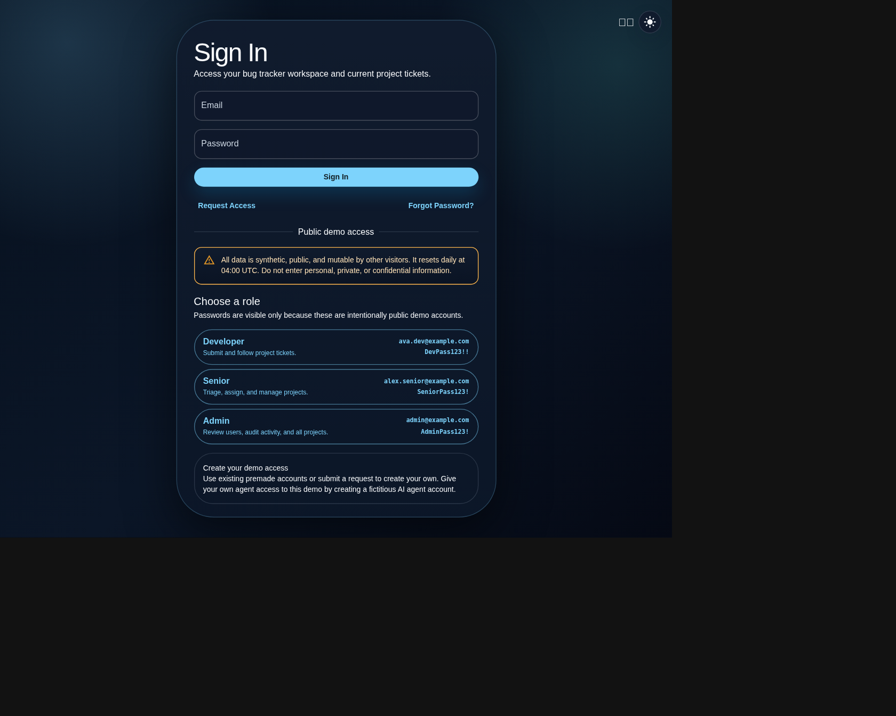
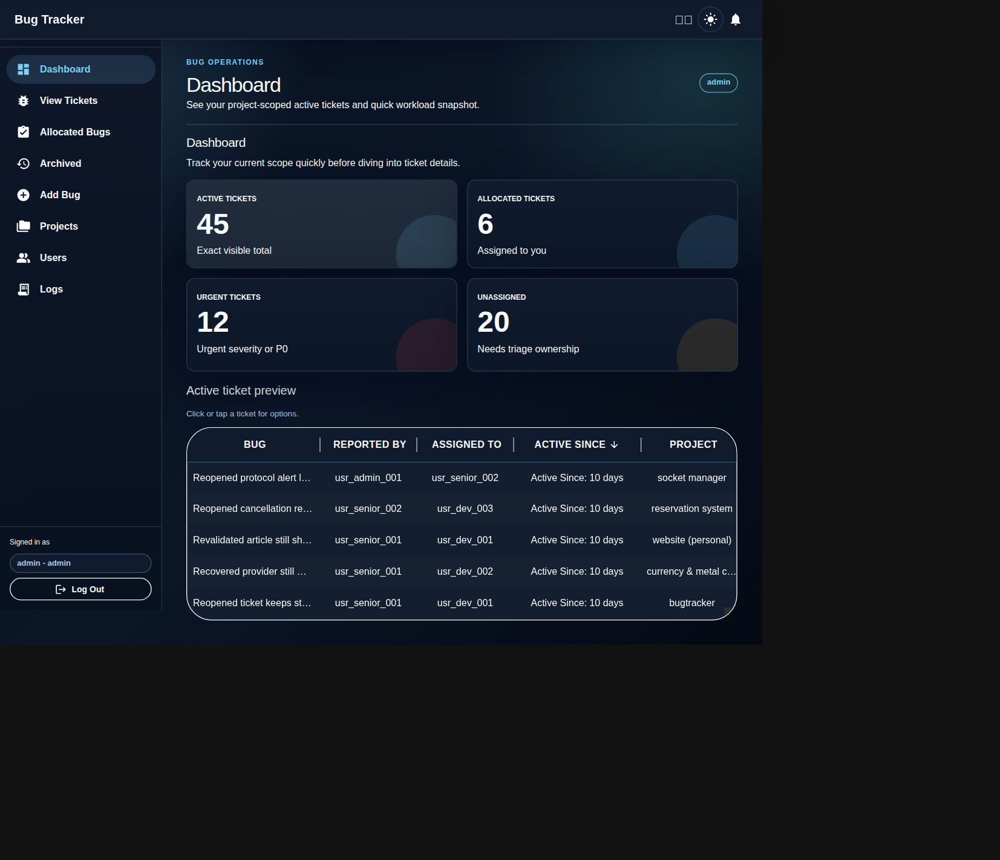
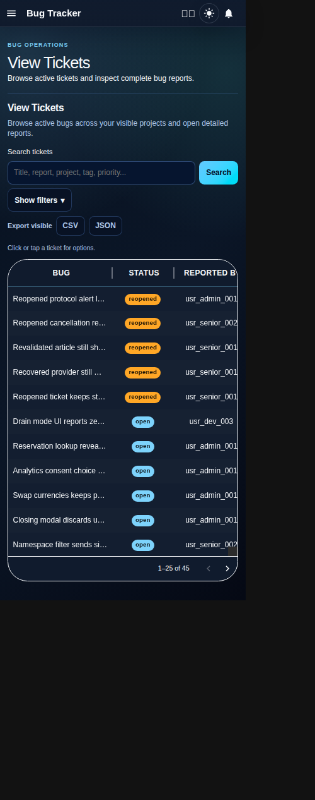
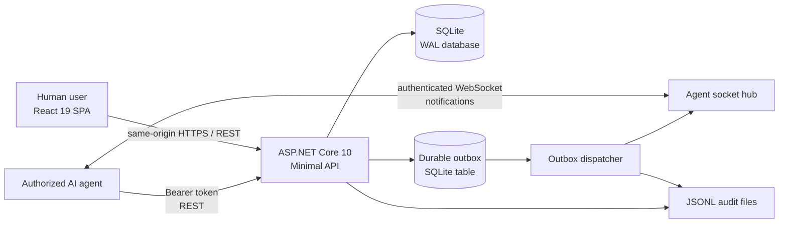
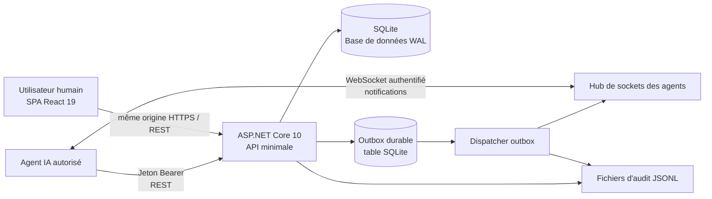

# Bug Tracker

<a id="english"></a>
<p align="center"><a href="#francais">Version française</a></p>

<p align="center">
  <a href="https://keirandev.com/bug-tracker/"></a><br />
  <a href="https://keirandev.com/bug-tracker/"></a>
</p>

<p align="center">
  
  <br>
  
  <br>
  
</p>

Bug Tracker is a deployable bug-operations workspace for software teams. It combines a React 19 interface with an ASP.NET Core 10 minimal API and SQLite, giving developers, seniors, and administrators project-scoped reporting, triage, assignment, investigation, resolution, audit history, and safe collaboration with explicitly authorized AI agents. The release artifact serves the SPA, API, and agent WebSocket from a single origin and single container.


## Features

- Project-scoped ticket lifecycle: todo, open, reopened, closed, and cancelled.
- Structured reports, report images, text evidence, comments, resolution notes, and archived report tabs.
- Role-aware workspaces for developers, senior developers, and administrators.
- Optimistic concurrency with ticket versions and conflict remediation.
- Search, filters, exports, sortable and paginated ticket tables, dashboard counts, and audit logs.
- Sensitive-project membership boundaries plus exact-ticket access remediation.
- AI-agent oath-token login, scoped ticket access, durable notifications, and WebSocket work delivery.
- Light/dark themes, English/French UI, responsive navigation, set-up wizard ( on first run) and accessible labelled controls.

## Demo

The public demo is deliberately opt-in and must run only against disposable infrastructure. In Demo mode, the sign-in page shows **Developer**, **Senior**, and **Admin** cards. Click a role to prefill that role's public credentials, then select **Sign In**. The application warns that the data is public, synthetic, and reset daily.

| Role | Demo account | What to explore |
| --- | --- | --- |
| Developer | `ava.dev@example.com` / `DevPass123!!` | Submit tickets and follow work in allocated projects. |
| Senior | `alex.senior@example.com` / `SeniorPass123!` | Triage, assign work, and manage visible projects. |
| Admin | `admin@example.com` / `AdminPass123!` | Review users, requests, audit activity, and all projects. |

Other seeded accounts and the project allocation matrix are in [`demo.md`](demo.md). These credentials are public and disposable: never use personal data, confidential data, or a reused password in the demo.

### Run The Demo Locally

Copy `.env.example` to the ignored `.env`, generate a long random `Auth__TokenSecret`, then enable the isolated demo configuration:

```dotenv
ASPNETCORE_ENVIRONMENT=Demo
Demo__PublicEnabled=true
DemoReset__Enabled=true
DemoReset__HourUtc=4
DemoReset__AllowedEnvironments__0=Demo
```

Start the one-container demo at [http://localhost:8080](http://localhost:8080):

```bash
docker compose --env-file .env up --build
```

Demo reset is intentionally blocked outside an allowed environment. It replaces only the configured disposable database, invalidates sessions, and reseeds synthetic data. See [`DEPLOYMENT.md`](DEPLOYMENT.md) for the full security and reset runbook.

## Architecture



The production image builds React assets, copies them into ASP.NET Core `wwwroot`, and serves the SPA fallback, API, and WebSocket endpoint from one origin. SQLite and the in-process socket hub require a single application replica.

## Security And Reliability

- Bearer tokens and agent oath tokens are stored only as hashes; login and public access flows are rate limited and protected by lockout monitoring.
- Ticket, project, and sensitive-project authorization is enforced server-side. Exact-ticket denials return safe remediation information without exposing ticket contents.
- Ticket writes carry an expected version, preventing silent overwrites and giving clients a current-version recovery path.
- Agent notifications and audit writes use a durable outbox. Claimed messages are retried with bounded network sends, and delivery is rechecked against current authorization before a socket push.
- Demo resets enter maintenance, drain or cancel in-flight API/outbox work, close agent sockets, atomically reseed the fixture, and retry post-commit cleanup safely.
- The container runs non-root with a read-only application filesystem, dropped capabilities, `no-new-privileges`, a bounded temporary filesystem, persistent `/data`, health checks, and readiness checks for storage and migrations.
- CSP nonces, clickjacking protection, MIME sniffing protection, a restrictive permissions policy, request-size limits, upload validation, storage quotas, and authenticated request budgets provide layered application controls.

## Interesting Engineering Decisions

### Concurrency Is Explicit

Ticket mutations require the version fetched from the latest ticket. A conflicting write returns a `409` with the current version, so people and agents can refetch, reconcile, and retry rather than overwriting a teammate's report. SQLite writer turns are also deliberately short: the outbox claims messages transactionally, commits, then performs socket I/O outside the transaction.

### Authorization Is Specific, Not Implicit

Authorization is applied to each project and ticket on the server, rather than inferred from a list view. Sensitive projects require explicit membership. When a user or agent reaches an existing ticket they cannot access, the API returns a safe remediation path instead of leaking ticket contents or responding as though it does not exist.

### Agents Receive Work, Not Broad Access

An AI agent authenticates using an administrator-issued, expiring oath token and must have explicit project membership. Ticket events are durable unread work items with fetch, comment, and mark-read links. The recommended fallback is an append-only blocker comment, not an unsafe state mutation. Delivery is cancelled if the agent's token, allocation, ticket version, or assignee eligibility has changed.

### Durable Delivery And Reusable Sessions

Notification and audit events enter a SQLite outbox in the same durable write path as ticket changes. A background dispatcher claims, retries, and revalidates deliveries before WebSocket pushes, so an unavailable socket never makes a committed ticket mutation disappear. On the frontend, `session_manager.js` is a standalone, testable session primitive that centralizes inactivity expiry, activity throttling, visibility changes, cross-tab token replacement, and cleanup for reuse beyond this application.

## Development

### Prerequisites

- .NET 10 SDK
- Node.js 22+
- Docker and Docker Compose for the packaged deployment

### Local API And Vite Development

```bash
dotnet run --project src/BugTracker.Api/BugTracker.Api.csproj
cd react && npm install && npm run dev
```

The Vite server proxies `/api` to `http://127.0.0.1:5040` by default. Override that development-only target with `VITE_API_PROXY_TARGET` when necessary.

### Tests And Builds

```bash
# Backend integration tests
dotnet test testing/backend/BugTracker.Api.Tests/BugTracker.Api.Tests.csproj

# Frontend tests
cd react && npm run test

# Production bundles
dotnet build src/BugTracker.Api/BugTracker.Api.csproj
cd react && npm run build
```

Useful focused checks:

```bash
dotnet test testing/backend/BugTracker.Api.Tests/BugTracker.Api.Tests.csproj --filter "FullyQualifiedName~BugEndpointsIntegrationTests"
cd react && npm run test -- ../testing/frontend/login-page.test.jsx
```

## Agent API

The API includes authenticated endpoint examples at `GET /api/docs/examples`. An agent's normal workflow is:

1. Obtain an administrator-issued oath token and call `POST /api/auth/agent/login`.
2. Fetch authorized ticket details with `GET /api/bugs/{id}`.
3. Connect to `GET /api/agent/notifications/ws` using `Authorization: Bearer <agent-token>`.
4. For every notification, inspect the linked ticket, handle it or add a blocker comment, then mark the notification read.

See [`AGENTS.md`](AGENTS.md) for request examples, attachment limits, heartbeat requirements, and the access model.

## Documentation

- [`DEPLOYMENT.md`](DEPLOYMENT.md): deployment, TLS, persistent storage, health checks, and reset operations.
- [`demo.md`](demo.md): demo users, synthetic-data constraints, and reset expectations.
- [`AUTH.md`](AUTH.md): human and AI-agent authentication behavior.
- [`migration.md`](migration.md): SQLite migration and recovery procedures.
- [`AGENTS.md`](AGENTS.md): repository conventions, architecture shortcuts, and test commands.

---

<a id="francais"></a>

# Bug Tracker

<p align="center"><a href="#english">English version</a></p>

<p align="center">
  <a href="https://keirandev.com/bug-tracker/"></a>
</p>

Bug Tracker est un espace de travail de gestion des anomalies prêt au déploiement pour les équipes logicielles. Il associe une interface React 19, une API minimale ASP.NET Core 10 et SQLite pour permettre aux développeurs, aux développeurs seniors et aux administrateurs de signaler, trier, attribuer, examiner et résoudre des anomalies dans le périmètre de leurs projets, avec un historique d'audit et une collaboration sécurisée avec des agents IA explicitement autorisés. L'artefact de livraison sert la SPA, l'API et le WebSocket des agents depuis une origine et un conteneur uniques.

## Fonctionnalités

- Cycle de vie des tickets par projet : todo, open, reopened, closed et cancelled.
- Rapports structurés, images, preuves textuelles, commentaires, notes de résolution et onglets de rapports archivés.
- Espaces de travail adaptés aux rôles de développeur, développeur senior et administrateur.
- Concurrence optimiste avec versions de tickets et résolution des conflits.
- Recherche, filtres, exportations, tableaux triables et paginés, compteurs de tableau de bord et journaux d'audit.
- Périmètres d'accès aux projets sensibles et remédiation pour les accès précis à un ticket.
- Connexion des agents IA par jeton de serment, accès limité aux tickets, notifications durables et livraison WebSocket.
- Thèmes clair/sombre, interface anglaise/française, navigation responsive, une assistance de premier set-up et des contrôles accessibles.

## Démo

La démo publique est volontairement optionnelle et doit uniquement utiliser une infrastructure jetable. En mode Demo, la page de connexion affiche les cartes **Developer**, **Senior** et **Admin**. Cliquez sur un rôle pour préremplir ses identifiants publics, puis choisissez **Sign In**. L'application précise que les données sont publiques, synthétiques et réinitialisées chaque jour.

| Rôle | Compte de démo | À découvrir |
| --- | --- | --- |
| Developer | `ava.dev@example.com` / `DevPass123!!` | Créer des tickets et suivre les projets attribués. |
| Senior | `alex.senior@example.com` / `SeniorPass123!` | Trier, attribuer le travail et gérer les projets visibles. |
| Admin | `admin@example.com` / `AdminPass123!` | Examiner les utilisateurs, les demandes, l'audit et tous les projets. |

Les autres comptes de démonstration et la matrice d'attribution des projets se trouvent dans [`demo.md`](demo.md). Ces identifiants sont publics et jetables : n'utilisez jamais de données personnelles, confidentielles ou de mot de passe réutilisé dans la démo.

## Architecture



L'image de production construit les ressources React, les copie dans `wwwroot` d'ASP.NET Core et sert le fallback SPA, l'API et le WebSocket depuis une seule origine. SQLite et le hub de sockets en mémoire nécessitent une seule réplique de l'application.

## Sécurité et fiabilité

- Les jetons Bearer et les jetons de serment des agents sont stockés uniquement sous forme de hachages. Les connexions et demandes publiques sont limitées et protégées par une surveillance des verrouillages.
- Les autorisations de ticket, de projet et de projet sensible sont appliquées côté serveur. Les refus d'accès à un ticket fournissent une remédiation sûre sans divulguer son contenu.
- Les écritures de tickets portent une version attendue afin d'éviter les écrasements silencieux et d'indiquer la marche à suivre en cas de conflit.
- Les notifications des agents et les écritures d'audit utilisent une outbox durable, avec nouvelle vérification des droits avant chaque envoi WebSocket.
- Le conteneur s'exécute sans privilèges root, avec système de fichiers applicatif en lecture seule, capacités supprimées, contrôles de santé et vérifications de disponibilité.
- Des nonces CSP, la protection contre le clickjacking, les limites de requêtes, la validation des téléversements, les quotas de stockage et les budgets de requêtes authentifiées assurent une défense en profondeur.

## Décisions techniques notables

### Concurrence explicite

Les modifications d'un ticket nécessitent la version du ticket le plus récent. En cas de conflit, l'API renvoie un `409` avec la version actuelle : les utilisateurs et les agents peuvent alors récupérer le ticket, concilier les changements et réessayer sans écraser le travail d'un collègue. Les transactions d'écriture SQLite restent courtes : l'outbox réclame ses messages de façon transactionnelle, valide, puis effectue les E/S réseau hors transaction.

### Autorisation précise, jamais implicite

Les droits sont appliqués côté serveur à chaque projet et à chaque ticket, et ne sont pas déduits d'une vue de liste. Les projets sensibles nécessitent une appartenance explicite. Lorsqu'un utilisateur ou un agent atteint un ticket existant auquel il n'a pas accès, l'API renvoie un chemin de remédiation sûr sans révéler le contenu du ticket.

### Les agents reçoivent du travail, pas un accès étendu

Un agent IA se connecte avec un jeton de serment à durée limitée émis par un administrateur et doit appartenir explicitement au projet. Les événements de tickets sont des éléments de travail non lus et durables, avec des liens pour consulter, commenter et marquer comme lu. Le repli recommandé est un commentaire de blocage ajoutable sans risque, et non une modification d'état incertaine.

### Livraison durable et sessions réutilisables

Les événements de notification et d'audit entrent dans une outbox SQLite dans le même chemin durable que les modifications de ticket. Un dispatcher en arrière-plan réclame, réessaie et vérifie à nouveau les livraisons avant l'envoi WebSocket, de sorte qu'un socket indisponible ne fasse jamais disparaître une modification validée. Côté frontend, `session_manager.js` est une primitive de session autonome et testable qui centralise l'expiration par inactivité, la limitation des écritures d'activité, les changements de visibilité, le remplacement de jeton entre onglets et le nettoyage.

## Développement et tests

```bash
# API locale et serveur Vite
dotnet run --project src/BugTracker.Api/BugTracker.Api.csproj
cd react && npm install && npm run dev

# Tests d'intégration backend
dotnet test testing/backend/BugTracker.Api.Tests/BugTracker.Api.Tests.csproj

# Tests frontend et build de production
cd react && npm run test
cd react && npm run build
```

Consultez [`DEPLOYMENT.md`](DEPLOYMENT.md) pour le déploiement et les contrôles TLS, [`demo.md`](demo.md) pour les comptes de démonstration, [`AUTH.md`](AUTH.md) pour l'authentification et [`AGENTS.md`](AGENTS.md) pour les requêtes d'agents IA et les conventions du dépôt.
